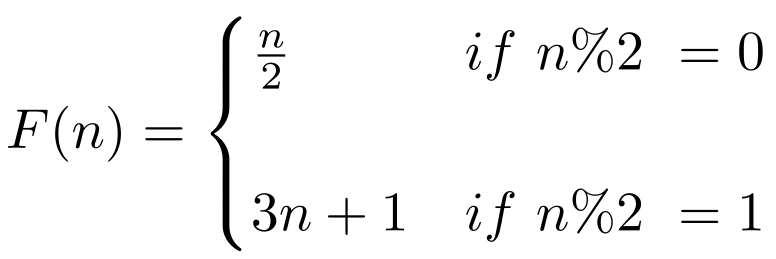

<h1 align="center"> Collatz-Conjecture (3n+1) </h1>

This Collatz-Conjecture (3n+1) algorithm prints each calculated sequence in a given interval of integers. 

 

 The Collatz-Conjecture is a conjecture in mathematics that concerns a sequence defined as follows: 
 

1. start with any positive integer and store in n
2. if n is even, then divide by 2
3. if n is odd, then multiply by 3 and add 1
4. repeat until n is 1

    

 The conjecture is that no matter what value of n, the sequence will always reach 1 at some point. 

